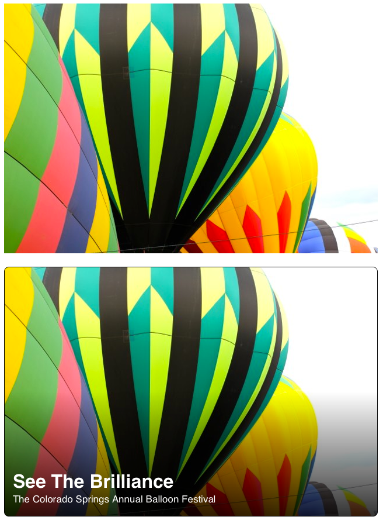

Vignette Image View
===================================

This effect has become pretty common in apps I've seen--namely Groupon. The images there have a vignetted look to them where the top of the image is clear, but they transition to a black color via a gradient at the bottom. I just took a standerd UIImageView and inserted a gradient layer that transitions top to bottom from clear color to black. Then, I add some UILabels in front of it and I get something like the image below. The top image is a before and the bottom is after.



You don't need to write any code to implement this one. Just add a UIImageView to your XIB or StoryBoard and set it's class in the Interface Builder to 'MLVignetteView' after adding its header and implementation file to your project. The entire implementation looks like this:

```
#import "MLVignetteView.h"

@implementation MLVignetteView

- (id)initWithFrame:(CGRect)frame
{
  self = [super initWithFrame:frame];
  if (self) {
    [self adorn];
  }
  return self;
}

- (id)initWithCoder:(NSCoder *)aDecoder
{
  self = [super initWithCoder:aDecoder];
  if (self) {
    [self adorn];
  }
  return self;
}

- (void)adorn
{
  CAGradientLayer *vignetteLayer = [CAGradientLayer layer];
  [vignetteLayer setBounds:[self bounds]];
  [vignetteLayer setPosition:CGPointMake([self bounds].size.width/2.0f, [self bounds].size.height/2.0f)];
  UIColor *lighterBlack = [UIColor colorWithRed:0.0f green:0.0f blue:0.0f alpha:0.8];
  [vignetteLayer setColors:@[(id)[[UIColor clearColor] CGColor], (id)[lighterBlack CGColor]]];
  [vignetteLayer setLocations:@[@(0.50), @(1.0)]];
  
  [[self layer] setBorderWidth:1.0f];
  [[self layer] setCornerRadius:8.0f];
  [[self layer] setMasksToBounds:YES];
  [[self layer] addSublayer:vignetteLayer];
}

@end
```

The code is MIT licensed. Have fun with it. Submit pull requests if you add some cool or interesting additions. 

Thanks and have fun.


